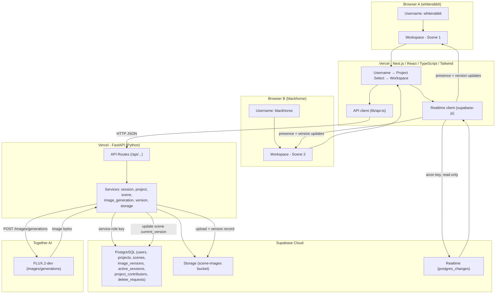
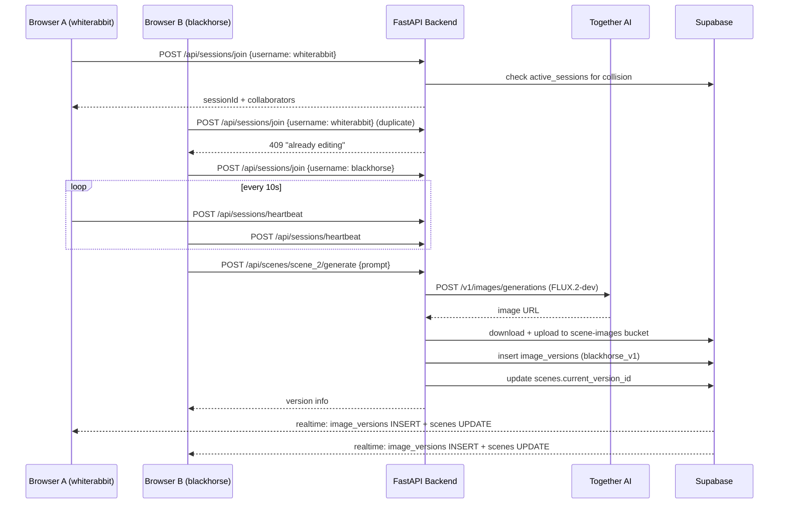
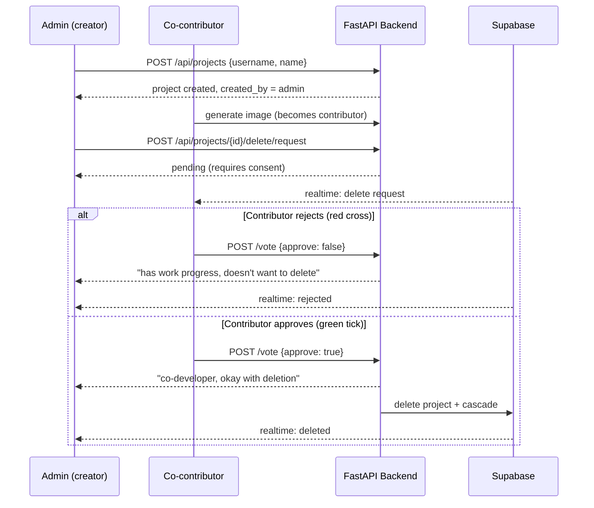
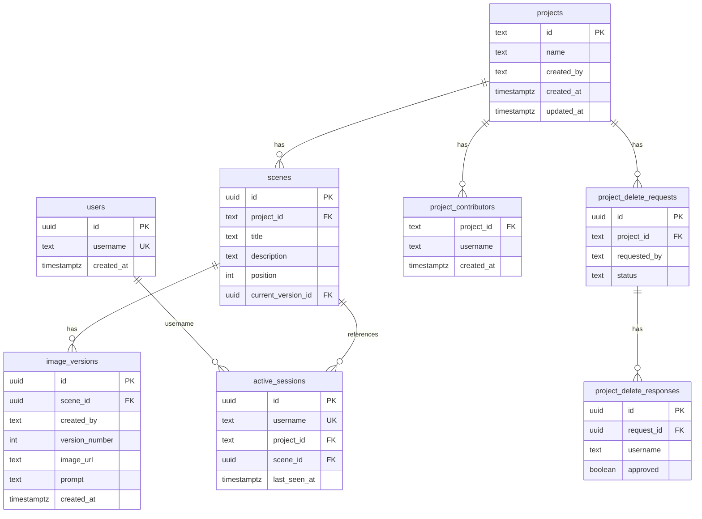

# StorySync — System Architecture (Mermaid)

```mermaid
flowchart TB
    subgraph BrowserA["Browser A (whiterabbit)"]
        UA["Username: whiterabbit"]
        WA["Workspace - Scene 1"]
    end

    subgraph BrowserB["Browser B (blackhorse)"]
        UB["Username: blackhorse"]
        WB["Workspace - Scene 2"]
    end

    subgraph VercelFrontend["Vercel - Next.js / React / TypeScript / Tailwind"]
        UI["Username → Project Select → Workspace"]
        API["API client (lib/api.ts)"]
        RT["Realtime client (supabase-js)"]
    end

    subgraph VercelBackend["Vercel - FastAPI (Python)"]
        ROUTES["API Routes (/api/...)"]
        SVC["Services: session, project, scene,\nimage_generation, version, storage"]
    end

    subgraph Cloud["Supabase Cloud"]
        PG["PostgreSQL (users, projects, scenes,\nimage_versions, active_sessions,\nproject_contributors, delete_requests)"]
        STORAGE["Storage (scene-images bucket)"]
        RT_DB["Realtime (postgres_changes)"]
    end

    subgraph TogetherAI["Together AI"]
        FLUX["FLUX.2-dev (images/generations)"]
    end

    UA --> WA
    UB --> WB
    WA --> UI
    WB --> UI
    UI --> API
    UI --> RT
    API -- "HTTP JSON" --> ROUTES
    ROUTES --> SVC
    SVC -- "service-role key" --> PG
    SVC --> STORAGE
    SVC -- "POST /images/generations" --> FLUX
    RT -- "anon key, read-only" --> RT_DB
    RT_DB --> RT
    RT -- "presence + version updates" --> WA
    RT -- "presence + version updates" --> WB

    FLUX -- "image bytes" --> SVC
    SVC -- "upload + version record" --> STORAGE
    SVC -- "update scene current_version" --> PG
```

# Key flows

```mermaid
sequenceDiagram
    participant A as Browser A (whiterabbit)
    participant B as Browser B (blackhorse)
    participant F as FastAPI Backend
    participant T as Together AI
    participant S as Supabase

    A->>F: POST /api/sessions/join {username: whiterabbit}
    F->>S: check active_sessions for collision
    F-->>A: sessionId + collaborators

    B->>F: POST /api/sessions/join {username: whiterabbit} (duplicate)
    F-->>B: 409 "already editing"
    B->>F: POST /api/sessions/join {username: blackhorse}

    loop every 10s
        A->>F: POST /api/sessions/heartbeat
        B->>F: POST /api/sessions/heartbeat
    end

    B->>F: POST /api/scenes/scene_2/generate {prompt}
    F->>T: POST /v1/images/generations (FLUX.2-dev)
    T-->>F: image URL
    F->>S: download + upload to scene-images bucket
    F->>S: insert image_versions (blackhorse_v1)
    F->>S: update scenes.current_version_id
    F-->>B: version info
    S-->>A: realtime: image_versions INSERT + scenes UPDATE
    S-->>B: realtime: image_versions INSERT + scenes UPDATE
```

# Project ownership and consent deletion

```mermaid
sequenceDiagram
    participant Admin as Admin (creator)
    participant Contrib as Co-contributor
    participant F as FastAPI Backend
    participant S as Supabase

    Admin->>F: POST /api/projects {username, name}
    F-->>Admin: project created, created_by = admin

    Contrib->>F: generate image (becomes contributor)

    Admin->>F: POST /api/projects/{id}/delete/request
    F-->>Admin: pending (requires consent)
    S-->>Contrib: realtime: delete request

    alt Contributor rejects (red cross)
        Contrib->>F: POST /vote {approve: false}
        F-->>Admin: "has work progress, doesn't want to delete"
        S-->>Admin: realtime: rejected
    else Contributor approves (green tick)
        Contrib->>F: POST /vote {approve: true}
        F-->>Admin: "co-developer, okay with deletion"
        F->>S: delete project + cascade
        S-->>Admin: realtime: deleted
    end
```

# Database schema

```mermaid
erDiagram
    users ||--o{ active_sessions : "username"
    projects ||--o{ scenes : "has"
    scenes ||--o{ image_versions : "has"
    scenes ||--o{ active_sessions : "references"
    projects ||--o{ project_contributors : "has"
    projects ||--o{ project_delete_requests : "has"
    project_delete_requests ||--o{ project_delete_responses : "has"

    users {
        uuid id PK
        text username UK
        timestamptz created_at
    }
    projects {
        text id PK
        text name
        text created_by
        timestamptz created_at
        timestamptz updated_at
    }
    scenes {
        uuid id PK
        text project_id FK
        text title
        text description
        int position
        uuid current_version_id FK
    }
    image_versions {
        uuid id PK
        uuid scene_id FK
        text created_by
        int version_number
        text image_url
        text prompt
        timestamptz created_at
    }
    active_sessions {
        uuid id PK
        text username UK
        text project_id FK
        uuid scene_id FK
        timestamptz last_seen_at
    }
    project_contributors {
        text project_id FK
        text username
        timestamptz created_at
    }
    project_delete_requests {
        uuid id PK
        text project_id FK
        text requested_by
        text status
    }
    project_delete_responses {
        uuid id PK
        uuid request_id FK
        text username
        boolean approved
    }
```
